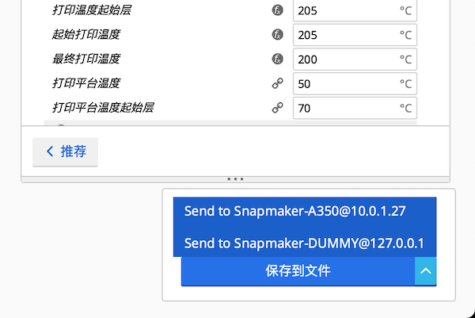
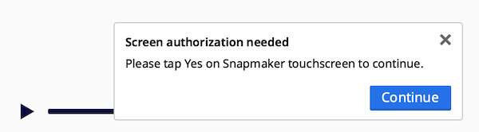
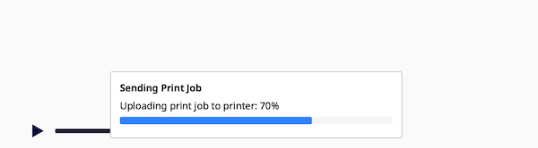
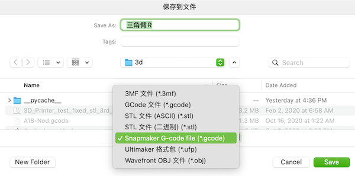

# Snapmaker 2 Plugin for Cura
- 无需配置，通过 UDP 广播自动查找局域网内所有 Snapmaker 2 设备
- 无需保存文件，使用网络直接发送到打印机进行作业
- 提供了 Snapmaker 2 兼容的 GCode 格式：显示缩略图、快速解析打印参数

# Installation
1. 从 Cura 的 Help 菜单下打开 Show Configuration Folder，进入 plugins 文件夹
2. 推荐使用 `git clone https://github.com/macdylan/Snapmaker2Plugin` 进行安装，或
3. 下载 release 的 zip 包，解压到该文件夹
4. 重启 Cura

# Usage
- 对模型切片后，将在 Save to File 按钮的位置出现设备选择菜单

    - 如果不出现这个菜单，可按照如下方法排查：
    1. 检查电脑的防火墙，是否阻止了 Cura 访问局域网（win10 默认会阻止）
    2. 等待 5-10 秒，Cura 会持续查找局域网内所有兼容设备并自动显示
    3. 重启 Snapmaker 2 并等待联网，因为它的应答服务可能挂了
    4. 检查路由器设置，是否阻止了 UDP 广播
    5. 如果可能，确保电脑、Snapmaker 2、路由器尽可能靠近，避免丢包率过高

- 选择需要发送的设备，点击 Send to
- 在 Snapmaker 2 触摸屏 WiFi Connection Request 中点击 Yes
- 回到 Cura 点击 Continue 按钮，等待文件发送完成

- 在 Snapmaker 2 触摸屏确认进行打印

- 你也可以使用 Save to File，将文件保存为 Snapmaker G-code file(*.gcode) 格式

